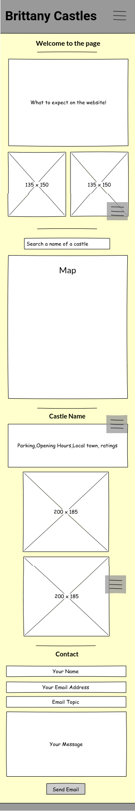
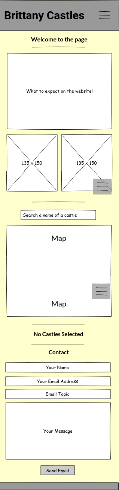
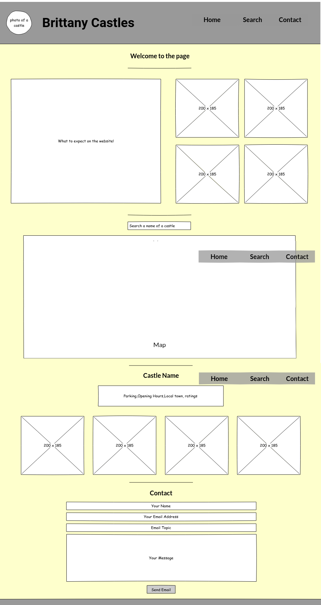
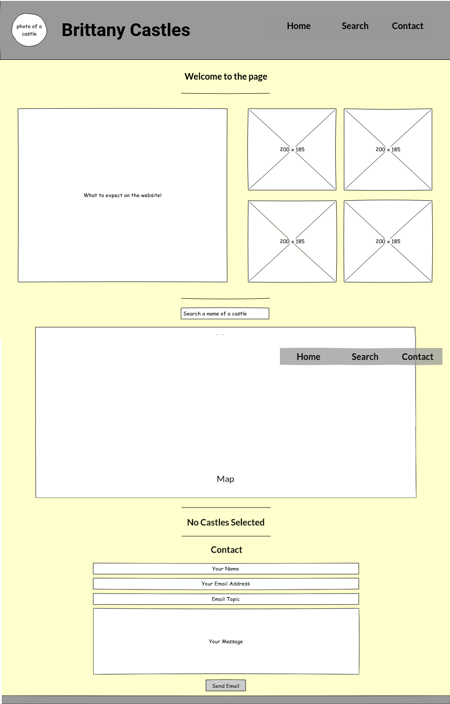

# Chateaux Of Brittany
## Interactive Frontend Development Milestone Project - Code Institute

The premise of this site is to provide information and photos of castles that are visitable in the Brittany area, ideal for those looking to take a holiday in Brittany.

A user can look up the castle or town and it will come up with some information - ratings, pictures, location. It will also give the user an opportunity to contact me directly with any possible questions or requests.
There is a landing page which will give some information to the users explaining what the website is doing and will include some photos I have taken from my personal collection of some of the castles I have found spectacular when I have visited them whilst on holiday.

I love visiting castles within Brittany, so wanted to share this niche experience with more people.
 
## UX

This website is designed to appeal to holiday-makers interested in visiting Brittany. It is meant as an idea for those who may or may not have realised the charming array of chateaux which litter the Brittany countryside.

For example, a trip could be planned to be closer to the castles of interest from the photos viewed, or it could offer a family options for attractions on rainy days or something further afield from a beach.

#### Strategy
For users that might be particularly interested in my personal photos, they might want to contact me for more information about where these castles were, or for further recommendations - which can be done using the "contact" part of the page.

For users that want to pick a holiday destination based on the amount of castles around, the map is able to furnish the user with searching the area they are interested in.

#### Scope
Key features to include are:
- A map that is scrollable and focuses on Brittany 
- A drop down navigation bar which is collapsible for smaller screen sizes, to create a sleeker look
- Extra features are to let the users know where the first photos from my collection are taken should they also want to visit, or look up the area
- Another feature is the contact form for emailing me

#### Structure
The page will have a standard footer and header in the colour theme chosen. 
Grouping the page into three sections of:
- Home page with a small section describing the website and some personal holiday photos 
- Map section which has a search bar
- Results section which updates relating to the castle chosen
- Contact page with form to contact me via email 

#### Skeleton
I created an original skeleton page using Pencil software which was then modified after the preliminary discussion with my mentor. The latest version of the skeleton can be found [here](assets/mockupDocumentation/wireframe.pdf). 

For ease of viewing, I have attached the main mockups below:
- Mobile page with a selection: 
    

- Mobile page without a selection: 
    

- Web page with a selection: 
    

- Web page without a selection: 

I created a tablet wireframe (included in the .pdf) as historically this came out differently when creating websites, so wanted to have a plan for this eventuality.

#### Surface
The light yellow colour scheme with grey theme was designed to feel modern and happy, yet chic and user friendly for all users. 

## Features
The majority of my website is built upon the grid system within Bootstrap, especially using the flex functionality. 
JavaScript and JQuery additions to Bootstrap allowed me to have a smoother drop down box which was collapsible for smaller screen sizes and a user friendly contact form. 

### Existing Features
- Contact form - allows users to contact me via email, by having them fill out the form. I have set this up so that it has a designed email template
- Photograph locations - allows the users to click on my personal photos and see which castle it is, so they can potentially look it up for further details
- Dropdown menu - allows users to have a minimised menu for smaller screen sizes

### Features Left to Implement
- Allowing users to make reviews directly from the website

## Technologies Used
- HTML 
    - The project uses **HTML5** as a base language for the webpage
- CSS 
    - The project is styled mainly using **CSS3** 
- [Bootstrap](https://getbootstrap.com/)
    - The project is structured using the **Bootstrap** grid system, implementing the flex attributes
- [JQuery](https://jquery.com)
    - The project uses **JQuery** to simplify DOM manipulation
- [JavaScript](https://www.javascript.com/)
    - The project uses **JavaScript** to send emails from the contact form, to use the map and retrieve information from Google Maps API
- [Font Awesome](https://fontawesome.com/)
    - The project uses **Font Awesome** for icons within the webpage
- [emailJS](https://www.emailjs.com/)
    - The project uses **emailJS** to send emails from the contact form to my personal account

## Testing
Testing for the welcome photos:
- I wanted to have the photos for all screen sizes, but I had 10 photos I wanted to use, so I had to create a system in the grid that would be suitable for all screen sizes
- Three columns looked messy with the 10 photos, so I moved it to having 5 per row, but this did not look good for smaller screen sizes
- For smaller screen sizes, I experimented with 4 on a row, but this again looked not as chic as I wanted, so I tested it with two rows of 3, and one of 4
- I then checked using Chrome Developer Tools to check with all different variants provided there to make sure that it still looked how I wanted it to

Testing the menu:
- The menu is one based on my last created web page, but I wanted to check that it worked
- The small menu item pushed into the margin that is not existent in the header bar, so I had to check margin sizes within the Bootstrap row
- I then tried clicking each menu item, and this successfully took me to the relevant section in the website, for both the expandable menu and the enlarged menu 

Testing the contact form:
- I wrote a script in jasmine to do this
1. Contact form:
    1. Go to the "Contact Us" page
    2. Try to submit the empty form and verify that an error message about the required fields appears
    3. Try to submit the form with an invalid email address and verify that a relevant error message appears
    4. Try to submit the form with all inputs valid and verify that a success message appears.

Testing the email using emailJS:
- 

In this section, you need to convince the assessor that you have conducted enough testing to legitimately believe that the site works well. Essentially, in this part you will want to go over all of your user stories from the UX section and ensure that they all work as intended, with the project providing an easy and straightforward way for the users to achieve their goals.

Whenever it is feasible, prefer to automate your tests, and if you've done so, provide a brief explanation of your approach, link to the test file(s) and explain how to run them.

In addition, you should mention in this section how your project looks and works on different browsers and screen sizes.

You should also mention in this section any interesting bugs or problems you discovered during your testing, even if you haven't addressed them yet.

## Deployment

This section should describe the process you went through to deploy the project to a hosting platform (e.g. GitHub Pages or Heroku).

In particular, you should provide all details of the differences between the deployed version and the development version, if any, including:
- Different values for environment variables (Heroku Config Vars)?
- Different configuration files?
- Separate git branch?

In addition, if it is not obvious, you should also describe how to run your code locally.

## Credits
### Content
Text was written by me within the site. Any information attached to the maps is from the Google Maps API and Google Places API.

### Media
The photos used in this site were taken from my personal collection of holiday photos. 
All information attached to the maps is retrieved from Google Maps API.
All icons are from the Font Awesome website.

### Acknowledgements
All elements which I have used within this page that were inspired by, or are from exteranl sources, are linked below:
- For the base information to create the flex system, I used [this page](https://getbootstrap.com/docs/4.0/utilities/flex/) as a reference
- To make the overlay on my personal images, I used ideas from this [tutorial](https://www.w3schools.com/howto/howto_css_image_overlay_title.asp) in order to provide extra information to users
- For the contact section, I used emailJS .. need to find where that's from actually..
- The dropdown menu was styled using the Bootstrap "navbar" item, found [here](https://getbootstrap.com/docs/4.0/components/navbar/), and was originally used in a previous project which can be found [here](https://github.com/CharOConnell/charlottes-web)
- Help for the Google Maps API / Google Places API found [here](https://developers.google.com/maps/documentation/javascript/places?hl=es)
- Help for styling the map was found [here](https://developers.google.com/maps/documentation/javascript/styling?hl=es)